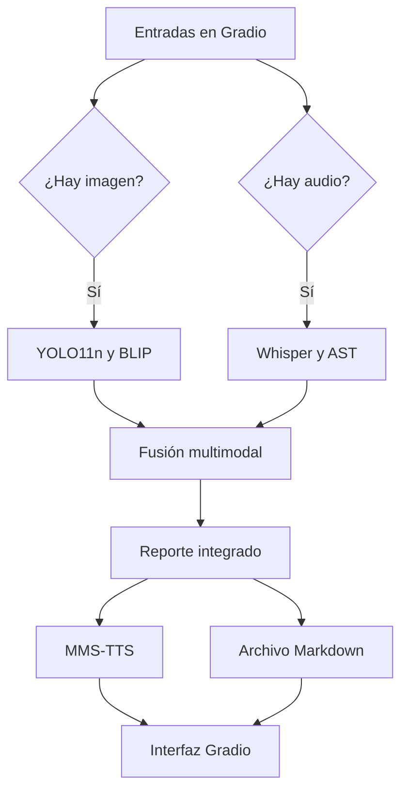

# Arquitectura técnica de MediaScope

## Descripción general

MediaScope utiliza una arquitectura multimodal mixta: paralela porque las ramas
visual y auditiva ejecutan tareas independientes; condicional porque puede
trabajar cuando solo existe una modalidad; y secuencial en las etapas de fusión,
generación del reporte y síntesis de voz.

## Diagrama del pipeline

## Conexión de las etapas

| Etapa | Entrada | Procesamiento | Salida | Conexión siguiente |
| --- | --- | --- | --- | --- |
| Adquisición | Imagen y/o audio | Gradio recibe archivo, cámara o micrófono | Archivos originales | Validación |
| Validación | PIL y ruta de audio | Revisa formato, dimensiones, tamaño y duración | Entradas normalizadas | Ramas visual y auditiva |
| Detección visual | Imagen RGB | YOLO11n localiza y clasifica objetos | Cajas, clases, cantidades y confianza | Fusión |
| Descripción visual | Imagen RGB | BLIP genera un caption contextual | Descripción de la escena | Fusión |
| Transcripción | Forma de onda a 16 kHz | Whisper reconoce el habla | Texto transcrito | Fusión |
| Clasificación acústica | Segmentos de audio de hasta 10 s | AST estima eventos ambientales | Etiquetas y confianza por intervalo | Fusión |
| Fusión multimodal | Resultados disponibles | Plantillas adaptadas a reporte Breve, Detallado o Accesible | Resumen integrado en español | TTS y exportación |
| Síntesis de voz | Texto fusionado | MMS-TTS genera una forma de onda | Narración WAV | Gradio |
| Exportación | Reporte y metadatos | Genera un documento Markdown con trazabilidad | Archivo descargable | Usuario |

## Modelos utilizados

| Modelo | Modalidad | Tarea | Resultado visible |
| --- | --- | --- | --- |
| YOLO11n | Imagen | Detección de objetos | Imagen anotada y tabla de objetos |
| BLIP base | Imagen | Captioning | Descripción contextual |
| Whisper base | Audio | Reconocimiento del habla | Transcripción |
| AST AudioSet | Audio | Clasificación acústica | Tabla temporal de sonidos |
| MMS-TTS español | Texto a audio | Síntesis de voz | Narración reproducible y descargable |

## Estrategia de fusión

La fusión no inventa relaciones entre la imagen y el audio. El módulo recibe las
salidas verificables de cada modelo, traduce las clases comunes a español,
selecciona los sonidos dominantes y construye un resumen. Si falta una entrada,
omite sus modelos y genera un reporte parcial. Esta decisión mantiene el
pipeline funcional y hace explícito qué evidencia estuvo disponible.

## Manejo de recursos

- Los modelos se cargan una sola vez y se conservan en memoria.
- CUDA se selecciona automáticamente cuando está disponible; de lo contrario,
  el sistema utiliza CPU.
- El audio se convierte a mono a 16 kHz y se limita a 30 segundos.
- La cola de Gradio procesa una solicitud a la vez para evitar competencia por
  memoria durante la demostración.
- Los pesos descargados se reutilizan desde la caché local.

## Cumplimiento de condiciones

1. **Dos modelos de visión:** YOLO11n realiza detección y BLIP realiza
   descripción; son modelos distintos y producen salidas diferentes.
2. **Audio dentro del pipeline:** Whisper y AST analizan la entrada, mientras
   MMS-TTS genera la narración final.
3. **Aplicación Gradio en vivo:** las entradas, controles, resultados y archivos
   se presentan mediante una interfaz interactiva ejecutada frente al público.

## Limitaciones

- Las predicciones son probabilísticas y dependen de la calidad de las entradas.
- BLIP puede generar captions en inglés.
- AST utiliza etiquetas de AudioSet y puede confundir sonidos acústicamente
  similares.
- El enlace público de Gradio es temporal y requiere conexión a Internet.
- MMS-TTS español utiliza una licencia no comercial, adecuada para esta
  demostración académica.
